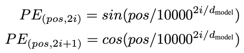

# Transformers 처음부터 만들어보기

## Input Embedding이란?
**텍스트를 임베딩 벡터로 변환하는 과정.** 트랜스포머에서는 512 크기의 임베딩 벡터로 바꾼다. 코드에서 진행한 nn.Embedding(vocab_size, d_model)은 Dense Embedding으로서, 정수 인덱스를 고정 크기의 밀집 벡터(dense vector)로 바꿔주는 역할을 한다.

## Positional Encoding이란?
  
각 단어가 해당 문서에서 위치한 절대적 위치를 인코딩한 것. 딱 한번만 계산된 후, 학습이나 추론 과정에서 사용된다.  
위치 인코딩은 pos(임베딩 벡터 개수)와 i(임베딩 차원 수)에 의존하므로, 같은 pos, i지만 다른 내용을 갖고 있는 두 임베딩의 위치 인코딩 값은 같다.  
- **질문 : sin, cos은 왜 쓴걸까? 그리고 왜 두개를 다 쓴걸까? sin, cos 중 하나만 써도 변별력 있지 않나?**
  - 하나의 삼각함수로만 인코딩하는 경우, 삼각함수의 주기가 2π이기에 주기를 지나친다면 처음 토큰과 값이 중복되는 문제가 발생한다. 그래서, 짝수번째는 sin, 홀수번째는 cos 함수를 사용해 중복을 최대한 없앤다.

## Encoder
- 이번 코드에서는 Encoder 내 Layer Normalization(LN)을 총 3번 실행한다.
  - MultiHeadAttention 후 ResidualConnection에서 1회차
  - FeedForwardAttention 후 ResidualConnection에서 2회차
  - Encoder 리턴하면서 3회차

1회, 2회는 아키텍처에 나와있으니 이해가 되었는데, 3회째, 즉 Encoder의 끝부분에서 왜 한번 더 LN을 해주는 지 이해가 안되었는데, pre-LN 방식과 post-LN 방식의 차이에서 기인한다고 한다.

#### Pre-LN
기존 Transformer 논문에서 채택한 Post-LN 방식은 Sublayer 후에 Add & Norm 하는 방식이다. 허나 이 방식보다 Norm 선 진행 후, **Sublayer를 거쳐 Add 하는 Pre-LN 방식이 학습 안정성에서 더 좋은 효과**를 보이기에 현대 Transformer 기반 모델은 대부분 Pre-LN을 채택한다.

### PyTorch 문법 정리
- torch.zeros(x, y) : x행 y열짜리 0으로 채운 행렬 반환
- torch.arange(x, y) : x부터 y까지 일정한 간격의 텐서 반환
- torch.arange().unsqueeze(i) : 텐서에 새로운 차원을 추가하는 함수.
  - i=0: 0번째 위치에 차원 추가. 주로 **배치를 만들고 싶을 때** 사용
  - i=1: 1번째 위치에 차원 추가. 주로 **특정 차원을 늘려야 할 때** 사용